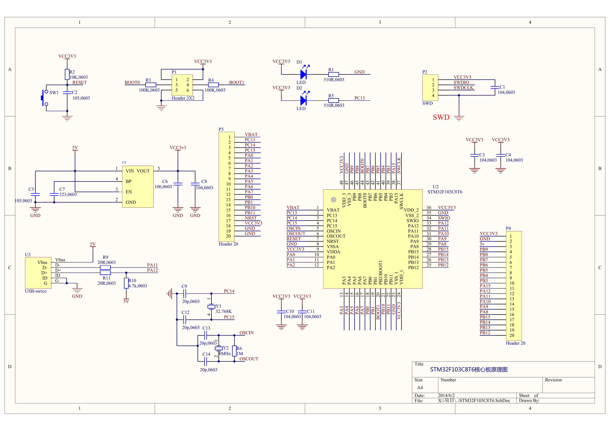
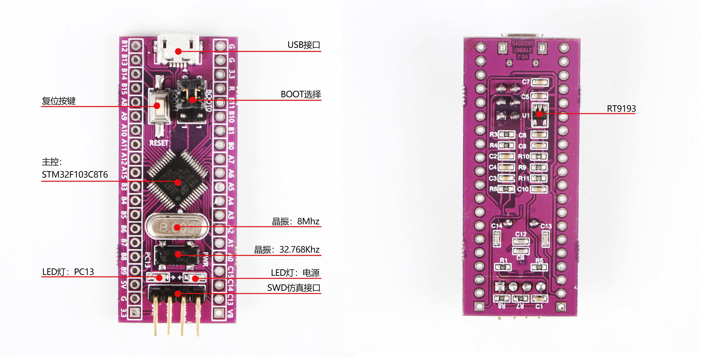

# STM32F103C8T6 最小系统板说明笔记

作者：王世伟  
创建日期：2026年9月29日

## 1. 芯片型号与特性

本板主控为 **STM32F103C8T6**：STM32 表示 ST 的 32 位 MCU 系列，F103 属于 STM32F1 性能型产品线；**C 为 48 引脚，8 为 64 KB Flash，T 为 LQFP 封装，6 为 −40～+85 °C 温度等级**。

| 项目 | 主要特性 |
| --- | --- |
| 内核 | 32 位 Cortex-M3，最高 72 MHz，无硬件浮点单元 |
| 存储 | 64 KB Flash 保存程序；20 KB SRAM 保存运行数据 |
| 供电 | 芯片 VDD 为 2.0～3.6 V，本板设计为 3.3 V |
| GPIO | 最多 37 个，实际使用受晶振、调试和板载连接影响 |
| 定时与采样 | TIM1 高级定时器、TIM2/3/4 通用定时器；两个 12 位 ADC，本封装共 10 路外部模拟输入 |
| 通信与调试 | 3 个 USART、2 个 SPI、2 个 I²C、USB 全速设备接口、CAN；支持 SWD/JTAG |
| 其他 | 7 通道 DMA、RTC、看门狗、SysTick |

**片上外设**是 MCU 内部的 USART、ADC 等模块；**板载器件**是 PCB 上的 LED、晶振、稳压器等。芯片有 CAN 控制器，不代表本板已有 CAN 收发器。资源和引脚须查数据手册中的 STM32F103x8、LQFP48 对应项。[数据手册][ds]

## 2. 系统架构

```text
Cortex-M3 内核 → 总线系统 → Flash / SRAM
                         ├─ AHB：DMA 等
                         ├─ APB1：TIM2/3/4、USART2/3、I²C 等
                         └─ APB2：GPIO、TIM1、USART1、ADC 等
RCC：管理时钟与复位；NVIC：管理中断；SysTick：内核定时基准
```

CPU 从 Flash 取指令，在 SRAM 中处理运行数据，通过读写外设寄存器控制硬件。Flash 掉电保留，SRAM 掉电丢失。中断使 CPU 响应事件；DMA 按配置搬运数据，减少 CPU 的搬运工作。

本板点灯的基本过程是：**使能 GPIOC 时钟 → 配置 PC13 为输出 → 输出低电平**。

芯片复位后先使用内部 HSI，最高 72 MHz 并非上电默认频率。常见配置为：**外部 8 MHz × PLL 9 倍 = SYSCLK 72 MHz，AHB 72 MHz，APB1 36 MHz，APB2 72 MHz**。这是配置示例，外设频率应按时钟树确定；APB 分频不为 1 时，对应定时器时钟为该 PCLK 的 2 倍。

## 3. 本板原理图说明





### 3.1 供电

供电路径为 **USB / 外部 5 V → LDO 稳压器 → 3.3 V → MCU 及板上电路**。SK03015 图将背面 U1 标为 **RT9193**，旧原理图对应稳压器位号为 U3；本板按 3.3 V 输出设计，实物完整型号和输出电压待核对。

[RT9193 官方参数][rt]：输入 2.5～5.5 V，最高输出 300 mA。它不能升压，2.5 V 输入不能稳出 3.3 V；300 mA 包含板上耗电，实际供电能力还受散热限制。

按原理图，VIN 接 5 V，EN 接 VIN 使能，VOUT 输出 3.3 V，GND 接地，BP 经电容接地降噪。C5 为输入滤波，C6/C8 为输出滤波，C7 为噪声旁路；MCU 供电脚附近的 100 nF 电容用于去耦，减小电源扰动。VDD/VDDA 接 3.3 V，VSS/VSSA 接地。

**5 V 只能接板上标明的 5 V 输入，不能接 3.3 V、VDD 或 VBAT；本板 5 V 输入也不能接 9 V/12 V。** 未确认防倒灌条件前选单一电源供电。

VBAT 为 RTC 和备份寄存器供电，不能替代 MCU 主电源。无备份电池时应按 ST 建议接 VDD 并去耦；图中该连接不明确，需核验。[硬件指南][an]

### 3.2 时钟、复位与启动

| 电路 | 本板连接与作用 |
| --- | --- |
| 高速晶体 | Y2 为 8 MHz，接 OSCIN/OSCOUT；C13/C14 各 20 pF，可作为系统时钟源并经 PLL 倍频 |
| 低速晶体 | Y3 为 32.768 kHz，接 PC14/PC15；C9/C12 各 20 pF，常用于 RTC |
| 复位 | NRST 低电平有效；R2=10 kΩ 上拉，C2=1 μF 滤波，按下 SW1 将其拉低复位 |
| 启动选择 | P1 跳帽设置 BOOT0、BOOT1；改变设置后复位生效 |

| BOOT0 | BOOT1 | 启动位置 |
| --- | --- | --- |
| 0 | 任意 | 用户 Flash，正常运行程序 |
| 1 | 0 | 系统存储器，厂商固化的启动程序 |
| 1 | 1 | SRAM |

正常使用保证 BOOT0 为低；SWD 下载通常不需要拉高 BOOT0。SW1 是复位键，不是用户按键。外部晶体并非运行程序的绝对必要条件，芯片也有内部时钟。

### 3.3 下载接口与板载外设

| 项目 | 连接与功能 |
| --- | --- |
| SWD 接口 P2 | 1：3.3 V；2：SWDIO，应连 PA13；3：SWCLK，应连 PA14；4：GND。用于烧录和调试，电压参考脚是否供电按调试器定义 |
| 电源灯 D1 | 接 3.3 V，经 R1=510 Ω 限流，由供电决定亮灭 |
| 用户灯 D2 | 接 PC13，经 R5=510 Ω 限流；PC13 输出低电平亮、高电平灭 |
| USB | VBUS 接 5 V，D−/D+ 分别经 20 Ω 接 PA11/PA12；数据功能需要对应固件 |
| 扩展排针 | P3/P4 各 20 针，合计引出 32 个不同 GPIO，其余为电源、地、复位及 VBAT |

PC13 驱动能力有限，需查专用脚注；它没有硬件定时器 PWM 通道。本板图中未画出 USB 转串口芯片、板载 ST-LINK 或 CAN 收发器，使用相关功能时需区分 MCU 内部资源与外接电路。

### 3.4 待核验事项

资料存在版本差异，以下不能仅凭图片确定：

- **供电**：确认实物 RT9193 完整型号、3.3 V 输出及 VBAT 连接。
- **网名**：旧图 `SWIO/SWDIO`、`SWCLK/SWDCLK`、`RESET/NRST` 不一致，需断电测对应连通性。
- **USB 上拉**：旧图 R10=4.7 kΩ 接 5 V；数据手册要求全速 D+ 上拉为 1.5 kΩ 接 3.0～3.6 V，需核对实物。

## 4. 如何读数据手册

| 资料 | 主要用途 |
| --- | --- |
| DS5319 数据手册 | 型号资源、封装引脚、复用功能、电气参数 |
| RM0008 参考手册 | 外设原理、寄存器与配置方法 |
| PM0056 编程手册 | Cortex-M3 内核、中断及指令 |
| AN2586 应用笔记 | 电源、时钟、复位、启动等硬件连接 |
| 开发板原理图 | 本板实际设计连接了哪些器件 |

查阅示例：在原理图找到 **PC13 → 在 LQFP48 引脚图确认第 2 脚 → 查引脚复用表 → 阅读输出电流、速度等特殊脚注 → 判断是否适合目标用途**。

读参数时同时看型号、封装、测试条件和脚注；**典型值不是全工况保证值，绝对最大额定值不是正常工作值**。只有特定引脚在指定条件下具有 5 V 容限，不能推广到全部 GPIO，也不表示能输出 5 V。

## 参考资料

- [本板原理图 PDF](../02_参考资料/STM32F103C8T6原理图.pdf)；[SK03015 器件图](../02_参考资料/SK03015-核心板器件说明.jpg)。
- [ST DS5319 数据手册][ds]；[AN2586 硬件指南][an]；[RT9193 官方资料][rt]。
- [ST 文档索引](https://www.st.com/en/microcontrollers-microprocessors/stm32f103/documentation.html)：可查 RM0008、PM0056 和勘误。本文未完成全部手册逐条核验。

[ds]: https://www.st.com/resource/en/datasheet/stm32f103c8.pdf
[an]: https://www.st.com/resource/en/application_note/cd00164185-getting-started-with-stm32f10xxx-hardware-development-stmicroelectronics.pdf
[rt]: https://www.richtek.com/en/Products/Linear%20Regulator/Single%20Output%20Linear%20Regulator/RT9193.aspx

---

> 本笔记由 Codex 辅助整理与撰写，依据开发板原理图、器件说明图及官方资料形成，供学习参考；尚未完成的实物核验以文中说明为准。
