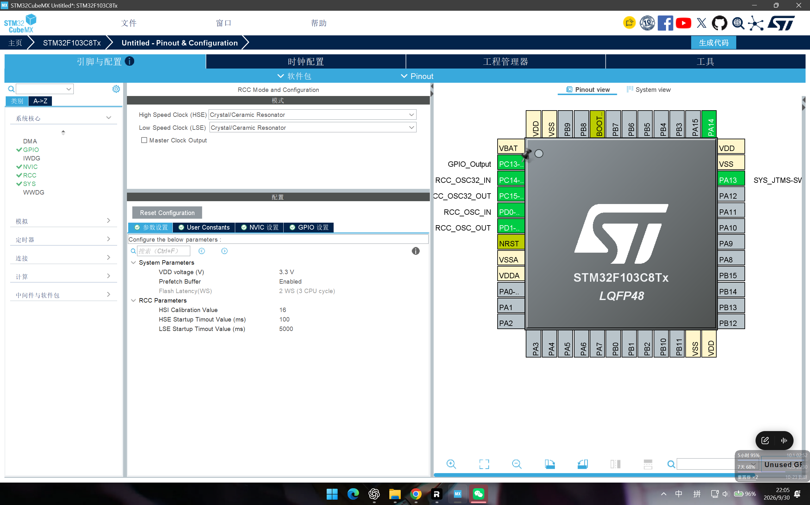
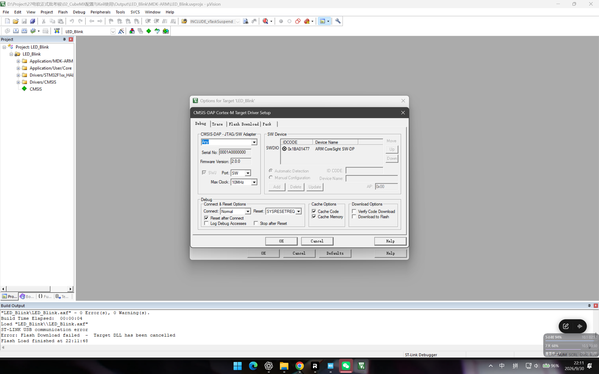
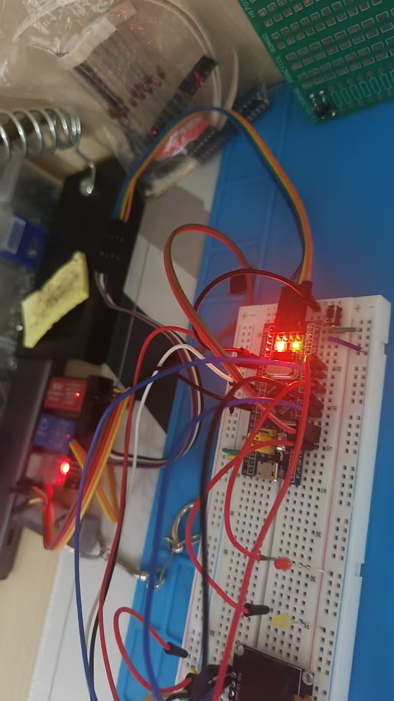

# CubeMX 配置与 Keil 点灯学习笔记

作者：王世伟  
创建日期：2026年9月30日

## 1. 实验目标与结果

本次使用 STM32CubeMX 配置 STM32F103C8T6 的系统时钟、PC13 GPIO 和 SWD 调试接口，生成 Keil MDK-ARM 工程。工程在 Keil μVision 中编译结果为 **0 Error、0 Warning**，调整下载器设置后成功下载到开发板，板载 LED 正常点亮。

| 项目 | 实际配置 |
| --- | --- |
| 主控 | STM32F103C8T6，LQFP48 |
| Cube 固件包 | STM32Cube FW_F1 V1.8.7 |
| 开发工具 | STM32CubeMX 6.18.1、Keil μVision 5.43.1 |
| 工程输出 | MDK-ARM V5.32 工程 |
| LED 引脚 | PC13，推挽输出、无上下拉、低速 |
| 调试接口 | SWD：PA13/SWDIO、PA14/SWCLK |
| 系统主频 | 72 MHz |

## 2. CubeMX 配置过程

### 2.1 芯片、GPIO 与 SWD

新建工程时选择 `STM32F103C8Tx`。将 PC13 配置为 `GPIO_Output`，初始输出为 Low。板载 LED 一端接 3.3 V，PC13 输出低电平时形成电流通路，因此 LED 为**低电平点亮**。

在 `System Core → SYS` 中将 Debug 设置为 `Serial Wire`，CubeMX 随即占用 PA13 和 PA14。这样既保留 SWD 下载调试能力，也比完整 JTAG 少占引脚。



截图中还选择了外部低速晶振 LSE，因此 PC14、PC15 被占用。本工程没有使用 RTC，生成的 `SystemClock_Config()` 实际只启用了 HSE。后续若无需 RTC，可以在 RCC 中关闭 LSE，释放 PC14、PC15并简化配置。

### 2.2 时钟树

板上 8 MHz 高速晶振作为 HSE，经 PLL 9 倍频得到 72 MHz 系统时钟：

```text
HSE 8 MHz × PLL 9 = SYSCLK 72 MHz
AHB 不分频：HCLK = 72 MHz
APB1 二分频：PCLK1 = 36 MHz
APB2 不分频：PCLK2 = 72 MHz
Flash Latency = 2 WS
```

APB1 最高只能工作在 36 MHz，因此必须二分频。虽然 PCLK1 为 36 MHz，但 APB1 分频不为 1 时，其定时器时钟会自动变为 2 倍，即 72 MHz；这一点会用于后续 PWM 配置。

### 2.3 生成工程

在 Project Manager 中将工程命名为 `LED_Blink`，Toolchain/IDE 选择 `MDK-ARM`，并启用保留用户代码。生成后的重要目录如下：

```text
LED_Blink/
├─ LED_Blink.ioc        CubeMX 配置源文件
├─ Core/Inc、Core/Src   应用层头文件和源文件
├─ Drivers/             HAL 与 CMSIS 驱动
└─ MDK-ARM/             Keil 工程文件
```

重新配置工程时应优先修改 `.ioc` 并重新生成；自己编写的代码放在 `USER CODE BEGIN/END` 区域，避免生成代码时被覆盖。

## 3. 生成代码如何点亮 LED

`main()` 依次调用 `HAL_Init()`、`SystemClock_Config()` 和 `MX_GPIO_Init()`。其中 `MX_GPIO_Init()` 的关键代码为：

```c
__HAL_RCC_GPIOC_CLK_ENABLE();

HAL_GPIO_WritePin(GPIOC, GPIO_PIN_13, GPIO_PIN_RESET);

GPIO_InitStruct.Pin = GPIO_PIN_13;
GPIO_InitStruct.Mode = GPIO_MODE_OUTPUT_PP;
GPIO_InitStruct.Pull = GPIO_NOPULL;
GPIO_InitStruct.Speed = GPIO_SPEED_FREQ_LOW;
HAL_GPIO_Init(GPIOC, &GPIO_InitStruct);
```

第一步使能 GPIOC 外设时钟；随后预先将 PC13 输出设置为低电平，再配置为推挽输出。先设置输出电平、再切换输出模式，可以避免初始化时出现不希望的瞬态。由于本次只要求点亮，主循环中不需要额外代码。

## 4. Keil 编译、下载与问题处理

打开 `MDK-ARM/LED_Blink.uvprojx` 后执行 Build。实际构建使用 Arm Compiler 5.06 update 7，结果为：

```text
LED_Blink.axf - 0 Error(s), 0 Warning(s)
```

编译成功只表示源代码能够生成目标文件，并不代表程序已经写入芯片。下载时必须选择与实际硬件一致的调试器。



这张截图记录了问题处理过程：下方 Build Output 中的 `ST-LINK USB communication error` 来自早期使用 ST-LINK 驱动下载，而实际连接的是 CMSIS-DAP/DAPLink，因此下载失败。随后在 `Options for Target → Debug` 中改用 **CMSIS-DAP Debugger**，接口选择 SW，并成功识别 `ARM CoreSight SW-DP`。最终完成下载并点亮 LED。

由此可区分：

- **编译错误**：代码、头文件、器件包或工程设置存在问题。
- **下载错误**：下载器类型、SWD 接线、供电、BOOT 或 Flash Algorithm 等存在问题。
- **运行错误**：程序虽已写入，但时钟、GPIO逻辑或硬件连接不符合预期。

## 5. 实物验证



实物测试确认开发板供电后程序能够运行，LED 已点亮，说明 CubeMX 配置、Keil 编译、SWD 下载和目标板运行链路已经打通。验收时建议再补拍一张开发板与目标 LED 的近景，减少复杂接线对结果辨认的影响。

## 6. Debug 操作要点

当前材料证明了编译、下载和运行成功。为了完整覆盖考核中的 Debug 要求，还应实际完成一次：

1. 在 `main()` 的 `MX_GPIO_Init()` 调用处设置断点。
2. 点击 `Start/Stop Debug Session`，确认程序能停在 `main()`。
3. 单步执行进入 `MX_GPIO_Init()`，观察 PC13 初始化过程。
4. 在 Watch 窗口观察变量，或在 Peripherals 窗口查看 GPIOC 相关寄存器。
5. 截取断点命中和黄色执行箭头的画面作为验收记录。

## 7. 本次掌握的内容

- 能在 CubeMX 中选择具体芯片，配置 GPIO、RCC、时钟树和 SWD。
- 能说明 HSE、PLL、SYSCLK、HCLK、PCLK1 和 PCLK2 的关系。
- 能生成 MDK-ARM 工程，并理解 `.ioc`、Core、Drivers 和 MDK-ARM 的用途。
- 能在 Keil 中编译并根据实际下载器选择 CMSIS-DAP 驱动。
- 能根据错误发生阶段区分编译、下载和运行问题。
- 能结合原理图解释 PC13 板载 LED 为什么低电平点亮。

---

> 本笔记由 Codex 辅助整理与撰写，配置参数取自实际 `LED_Blink.ioc`、生成代码、Keil 构建日志及本次实物测试记录。
