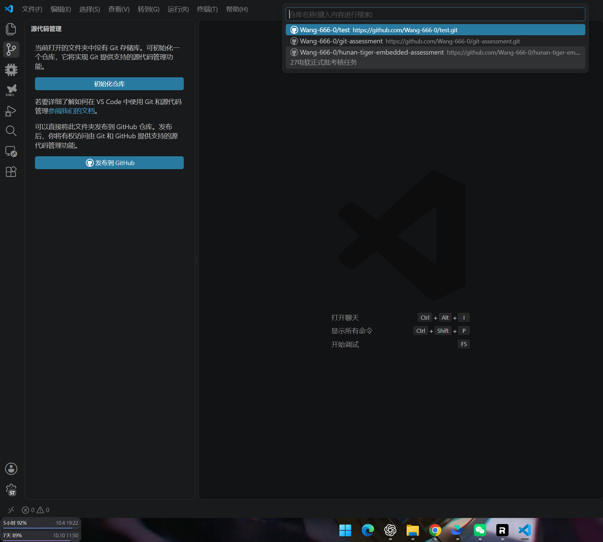
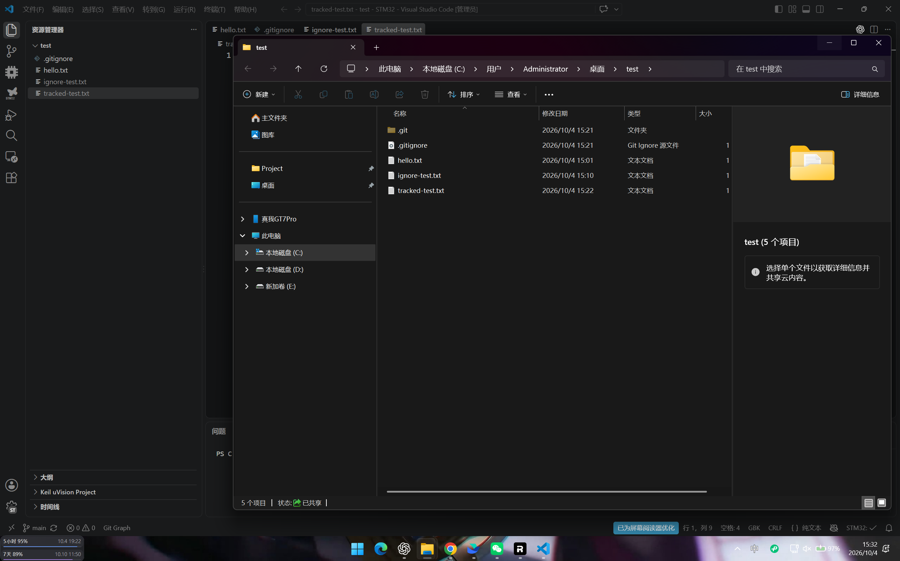
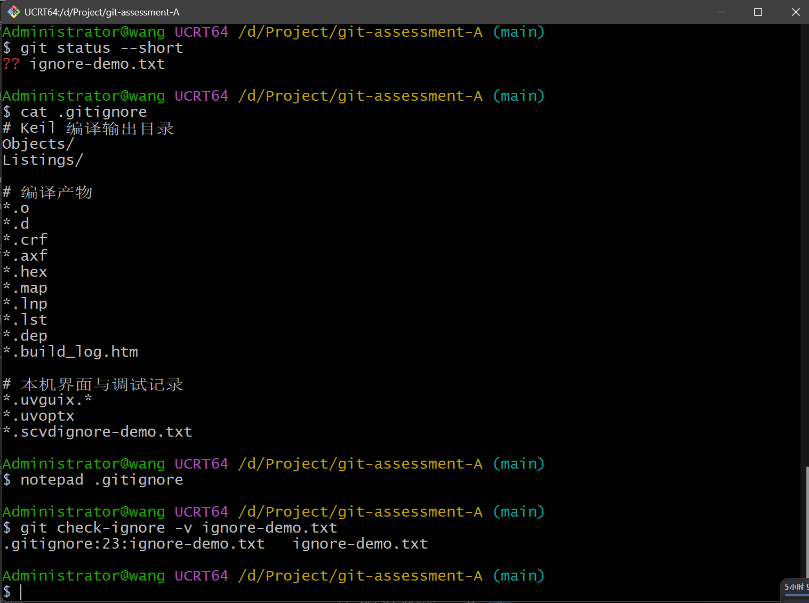
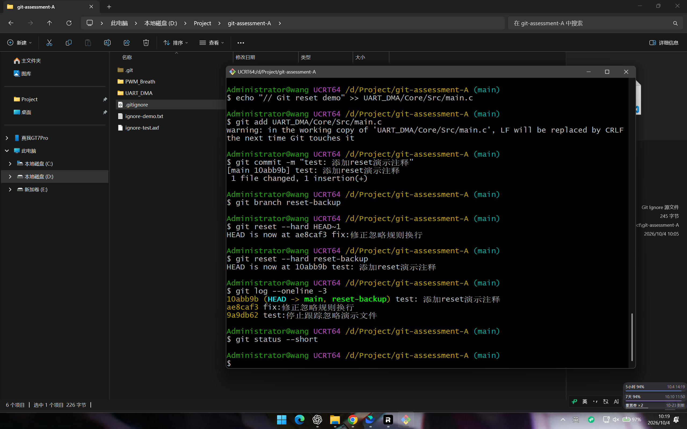
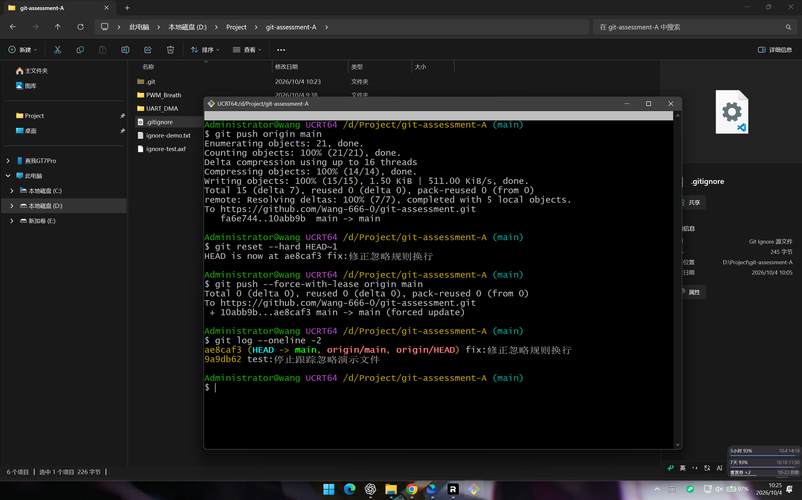
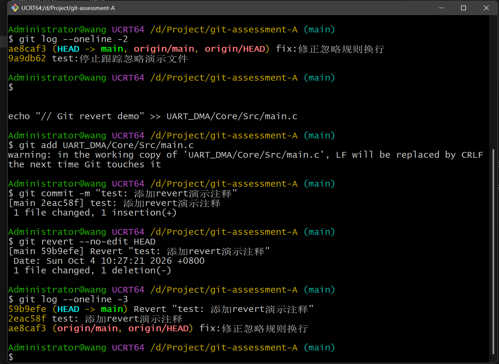
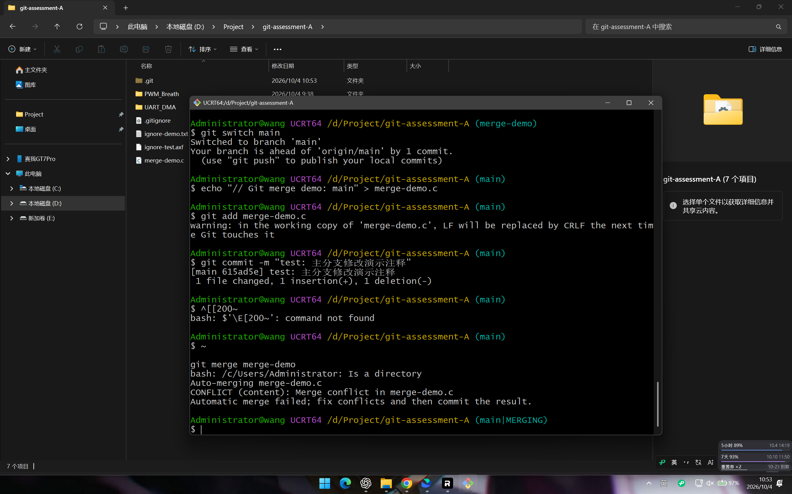
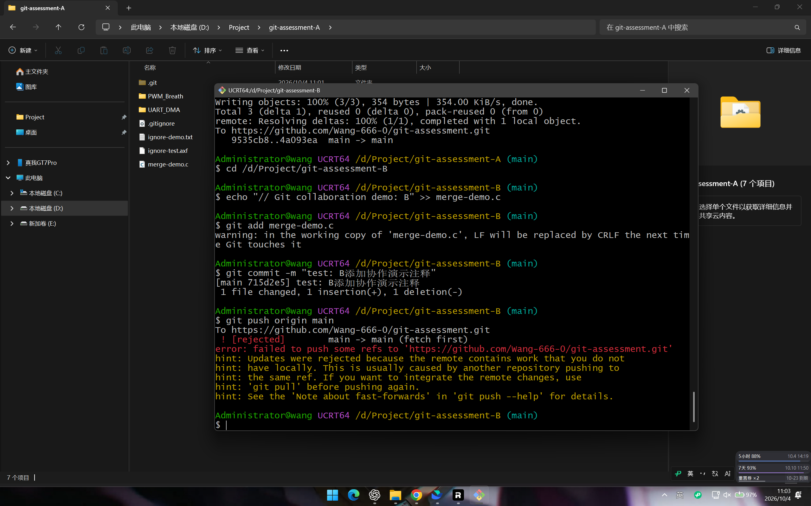
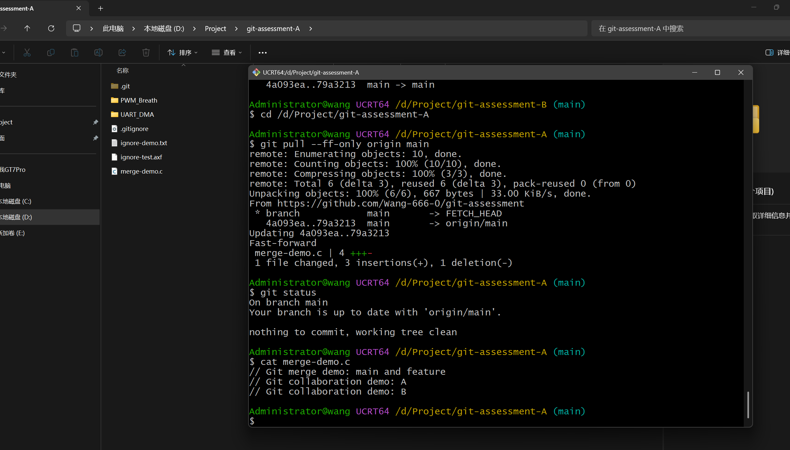

# Git 学习笔记

姓名：王世伟　创建日期：2026-10-04

本笔记根据本人考核操作、截图与追问整理，由 Codex 辅助编写. 重点记录 VS Code 和 Git Graph 的使用，命令行作为补充.

更新日期：2026-10-04. 补充桌面 test 仓库练习和操作问答.

## 1. 任务与使用环境

本次使用自己的 PWM_Breath 和 UART_DMA Keil 工程完成版本管理练习.

| 项目 | 本次使用 |
| --- | --- |
| 命令行 | Git Bash，截图终端标识为 UCRT64 |
| 图形界面 | VS Code，中文界面 |
| 辅助扩展 | Git Graph，发布者 mhutchie，英文菜单 |
| 远程仓库 | https://github.com/Wang-666-0/git-assessment |
| 原工程练习仓库现位置 | `D:\Project\27电软正式批考核\06_Git\02_练习仓库` |
| 本地副本 A | `D:\Project\git-assessment-A` |
| 本地副本 B | `D:\Project\git-assessment-B` |
| 主分支 | `main` |

考核内容包括创建仓库、暂存、提交、推送、克隆、忽略规则、reset、revert、分支合并及双仓库协作. 除创建仓库和解决冲突外，对应操作还需要用 VS Code 演示.

优先按第 2 节使用 VS Code 界面. 第 3～9 节保留 Git Bash 考核记录，第 10 节为指令速查. 新一轮界面练习使用桌面的 test 及克隆副本，文件包括 hello.txt、second.txt 等；远程曾出现 test.git 和 test0.git，使用时以实际 origin 地址为准.

## 2. VS Code 操作与问题复习

### 2.1 日常操作：初始化、提交、推送

“文件 → 打开文件夹”打开练习目录. 源代码管理快捷键 `Ctrl + Shift + G`，命令面板 `Ctrl + Shift + P`. 命令面板是界面菜单，不是终端命令行.

1. 新目录点击源代码管理中的“初始化仓库”，建立本地仓库.
2. 新建或修改文件，按 `Ctrl + S` 保存.
3. 在更改列表点击文件旁的 `+`，移入“暂存的更改”.
4. 输入提交说明，点击“提交”，保存到本地历史.
5. 自己的新仓库首次上传可选“发布到 GitHub”，登录后选择名称及公开/私有属性. 已有远程仓库可用 `Git: Add Remote` 添加地址，简称通常为 origin.
6. 后续点击源代码管理 `… → 推送`，有些版本在“拉取、推送”子菜单中.

顺序：修改 → 保存 → 暂存 → 填写说明 → 提交 → 推送.

| 状态或操作 | 含义 |
| --- | --- |
| 文件 M | 文件已修改 |
| 分支名旁的 * | 有未提交改动 |
| 1↑ | 有一笔提交待推送 |
| 1↓ | 有一笔已获取的远程提交待整合 |
| 更改列表为空 | 没有待提交改动，不代表已推送 |
| 推送 | 上传本地提交 |
| 拉取 | 获取并整合远程提交 |
| 同步更改 | 先拉取再推送 |

箭头计数依据最近获取的远程信息. 演示推送被拒绝时单独选“推送”，避免同步提前整合远程.

### 2.2 放弃更改与忽略规则

文件旁弯箭头“放弃更改”用于丢弃未提交修改. 已暂存内容可先点击 `−` 取消暂存，取消暂存会保留编辑内容. 丢弃新文件可能删除它，先看确认提示.

“放弃更改”不能停止跟踪文件，也不能撤销已提交版本. 已提交改动用 Revert，移动分支位置用 Reset.

在根目录 `.gitignore` 另起一行加入 `ignore-test.txt`，新建并保存同名文件. 文件存在，但更改列表不显示它，说明忽略生效. 提交 `.gitignore` 即可.

已经提交过的 `tracked-test.txt` 不会因新增忽略规则而自动停止跟踪. 尽量使用界面的练习方法：

1. 在仓库外备份文件内容.
2. 在 `.gitignore` 加入文件名，保存.
3. 删除仓库内文件，暂存删除与 `.gitignore`，提交.
4. 在同一路径重新创建文件，恢复内容并保存.
5. 确认文件不出现在更改列表中.

更简便的终端方法是 `git rm --cached tracked-test.txt`，再提交删除记录与忽略规则. 历史版本中的文件仍存在.

### 2.3 克隆：保存位置与已有副本缓存

1. 命令面板 → `Git: 克隆`（Git: Clone）.
2. 粘贴 HTTPS 地址，或从 GitHub 列表选仓库.
3. 选择保存的父目录，例如桌面的 Git副本. 通常会在里面新建以仓库名命名的子目录.
4. 等待完成，选择“在新窗口中打开”.
5. 在资源管理器右键根文件夹 → “在文件资源管理器中显示”，核对完整路径.

两个副本可以同名、内容相同，完整路径不同才是不同的本地副本. 克隆只包含远程已有内容，不包含原仓库未推送的提交、未提交编辑及被忽略文件.

本次选 test 看似没反应，选 git-assessment 打开已有文件夹，选第三个仓库才要求保存位置. 当前 VS Code 官方代码会先查询仓库缓存：命中当前工作区的副本可能直接返回，只有一个已知副本时可能直接打开它，没有有效缓存才进入实际克隆. 第一种现象还需本机日志确认.

所以不是“只能克隆一次”. 换窗口、关闭文件夹或再次输入相同地址都未必绕过缓存，“是否打开存储库”也不能单独证明刚创建了副本.

可尝试手动输入地址，将 `github.com` 改为 `GitHub.com`，不要再从 GitHub 列表选择原地址. 当前缓存没有统一域名大小写，因此这是版本相关的绕过方法，不是必需步骤. 增删 `.git` 后缀不能绕过此缓存.

界面仍复用原目录时，可在 VS Code 终端指定新目录，之后继续使用界面：

```powershell
git clone https://github.com/Wang-666-0/test.git "$env:USERPROFILE\Desktop\test-copy"
```

地址以实际远程为准，目标目录应不存在或为空. 克隆不修改原仓库和远程仓库. 完成后“文件 → 打开文件夹”选择新副本.

依据：[VS Code 克隆流程](https://github.com/microsoft/vscode/blob/main/extensions/git/src/cloneManager.ts)、[缓存处理](https://github.com/microsoft/vscode/blob/main/extensions/git/src/repositoryCache.ts). 本机行为以版本与日志为准.

[图 08 · GitHub 仓库选择与克隆异常（08_克隆仓库选择.png）](../03_过程记录/08_克隆仓库选择.png)



[图 09 · 核对实际打开的仓库路径（09_克隆路径核对.png）](../03_过程记录/09_克隆路径核对.png)



### 2.4 创建分支、切换与合并

1. 确认 main 更改列表为空.
2. 点击左下角分支名 → “创建新分支…” → 输入 feature-vscode，确认已切换过去.
3. 修改 hello.txt，保存、暂存、提交.
4. 点击分支名切回 main，新分支添加的内容暂时消失是正常现象.
5. 命令面板 → `Git: 合并分支`（Git: Merge Branch）→ 选择 feature-vscode.
6. 确认内容进入 main，再推送.

合并是把选择的分支合入当前分支，所以先切 main 再选练习分支. 直接向前更新可能没有分叉，也不一定生成额外合并提交.

### 2.5 制造并解决分支合并冲突

从 main 创建 conflict-demo，修改 second.txt 第一行并提交. 切回 main，将同一行改成不同内容并提交，再合并 conflict-demo.

出现“合并更改”后打开冲突文件：

| 按钮 | 本次分支合并中的含义 |
| --- | --- |
| 采用当前更改 | 保留 main 的内容 |
| 采用传入的更改 | 保留 conflict-demo 的内容 |
| 保留双方更改 | 两侧都保留，仍需检查重复与顺序 |
| 比较变更 | 查看差异再决定 |

也可以手动编辑成最终内容. 删除全部 `<<<<<<<`、`=======`、`>>>>>>>` 标记，保存 → 点击 `+` 暂存 → 提交合并结果 → 推送.

保留双方不保证代码正确，最终应检查是否重复定义或顺序错误.

### 2.6 中文乱码处理

本次正文正常，乱码位于冲突标记后的中文分支名. 可能是文件 GBK 与 Git 写入的 UTF-8 分支名混用，不表示解决冲突失败.

先处理冲突，删除标记和乱码分支名. 正文显示正常时，点击右下角编码 → “通过编码保存” → UTF-8，再暂存并完成操作.

正文也乱码时，先用“通过编码重新打开”选择原编码，恢复正确显示，再保存为 UTF-8. 不要直接保存乱码正文. 后续文本文件优先 UTF-8，练习分支名使用英文.

### 2.7 Revert：撤销提交并保留历史

在文件末尾添加练习行，保存、暂存、提交为 `test: revert练习`. 打开 Git Graph，右键这条提交 → Revert… → 确认. 如有 Create a new commit，保持勾选.

成功标志：练习行消失，原提交仍在，顶部新增 `Revert "test: revert练习"`，然后普通推送.

人为制造 revert 冲突：

1. 在 second.txt 末尾添加“版本 A”行，提交为“添加版本A”.
2. 将同一行改成“版本 B”，提交为“修改为版本B”.
3. 右键较早的“添加版本A”执行 Revert，不是撤销最新的 B.
4. 撤销 A 需要删除新增行，但 B 修改过这行，因此撤销暂停并出现冲突.

弹窗 Unable to Revert Commit 不表示提交丢失. Dismiss 只关闭提示，不取消撤销.

本次目标是删除 A 新增的行，因此删除对应冲突块的版本 B 行和全部标记，保留其他内容. 保存 → 点击 `+` 暂存 → VS Code 终端执行：

```powershell
git -c core.editor=true revert --continue
```

`revert --continue` 用处理并暂存的结果完成撤销；`-c core.editor=true` 仅本次不打开说明编辑器，保留默认说明，不自动解决冲突. 检查新增 Revert 提交和更改列表为空，再推送. 取消整个撤销用 `git revert --abort`.

revert 的传入侧是反向改动希望得到的内容，不能一概当成另一个分支的版本. 可以选择保留 B，但在这个练习中就没有删除 A 新增的行.

### 2.8 Reset：回退并用备份恢复

1. 在 main 添加 reset 练习行，提交为 `test: reset练习`，先不推送.
2. 创建 reset-backup 备份分支，再切回 main.
3. Git Graph 右键练习提交下面紧邻的旧提交 → Reset current branch to this Commit… → Hard.
4. 检查 main 移到旧提交、练习行消失，reset-backup 仍在回退前位置.
5. 恢复时右键带 reset-backup 标签的练习提交，同样 Reset → Hard.
6. 检查 main 回到备份位置、练习行恢复，再正常推送.

Hard 会丢弃未提交改动，先保存需要保留的内容. 备份分支只记录提交，不保留未提交编辑.

本轮没有把回退结果上传远程，因此恢复后普通推送即可. 已推送的远程历史也要倒退时，参看第 6 节；不能用“同步更改”代替强制推送.

### 2.9 双仓库协作：拒绝、冲突、整合

两个窗口分别打开 A 原仓库与 B 克隆副本. 确认路径不同、远程相同、双方都在 main、更改列表为空，先分别拉取到相同版本.

1. A 修改 second.txt 第一行，保存、暂存、提交并推送.
2. B 不先拉取，修改同一行，保存、暂存、提交.
3. B 单独点推送，远程已有 A 的提交，预期被拒绝.
4. B 关闭提示，选择拉取，使用普通合并方式，不选“拉取（变基）”.
5. 冲突中当前侧是 B，传入侧是远程 A.
6. 本次保留双方两行，检查后保存、暂存、提交合并结果，再推送.
7. A 再拉取，确认两边文件一致、更改列表为空、没有待同步提交.

若拉取要求选方式，本轮选择合并. 界面不能选择时可用 `git pull --no-rebase origin main`，后续继续界面处理.

不同文件的独立改动通常能自动整合. 推送拒绝表示历史未整合，文件内容冲突是在合并时发现的，两个提示含义不同.

### 2.10 网络错误和 Git 冲突怎么区分?

| 提示 | 处理 |
| --- | --- |
| Recv failure: Connection was reset | 网络中断，检查网络或正在使用的代理，再重试推送 |
| fetch first / non-fast-forward | 拉取并整合远程提交，再推送 |
| CONFLICT (content) | 编辑最终内容，暂存，完成合并或撤销 |
| 无法推送 refs | 通用提示，打开 Git 日志或显示命令输出查看具体原因 |

网络失败不会删除本地提交，不需要重新提交. 远程地址以实际仓库为准，test、test0 和 git-assessment 不要混用.

### 2.11 提交图怎么看?

- 圆点代表提交，文字是提交说明与作者.
- 上面通常较新，下面较旧，线条连接提交历史.
- 蓝、黄、粉色只区分路线，不代表成功或冲突.
- main 标签指向本地分支位置，origin/main 是最近获取的远程分支位置.
- 云朵样式标签与远程分支有关，悬停查看名称，不单凭云朵判断同步完成.
- 分叉表示独立修改路线，不等于内容冲突；两条线汇入“合并修改”，说明历史已整合.

本次协作：共同旧版本 → A、B 各自修改 → 顶部“合并修改”汇合. Revert 后原提交仍在，多一笔反向提交；Reset 后 main 标签移动，备份分支可以保留原位置.

### 2.12 Git Graph 英文菜单

| 英文 | 中文作用 |
| --- | --- |
| Create Branch | 创建分支 |
| Checkout | 切换分支或检出版本 |
| Reset current branch to this Commit | 当前分支重置到该提交 |
| Revert | 新增提交撤销指定改动 |
| Merge into current branch | 合入当前分支 |
| Push Branch | 推送分支 |
| Dismiss | 关闭提示，不取消操作 |

VS Code 已是中文界面，但本次 Git Graph 扩展菜单仍为英文，不能仅靠切换 VS Code 语言保证扩展翻译.

## 3. 创建仓库、暂存和提交

先将自己的 Keil 工程复制到练习目录，再进入目录执行：

```bash
git init
git status
```

`git init` 将当前目录初始化为仓库，通常会生成隐藏目录 `.git`. 它是普通本地仓库的标志，保存版本管理信息，不要随意删除. 本次初始化后的分支是 `main`.

`git status` 查看当前状态. `Untracked files` 表示文件还没有被 Git 跟踪，`No commits yet` 表示尚未提交任何版本.

先编写下一节的 `.gitignore`，然后暂存并提交：

```bash
git add .
git status
git commit -m "首次提交PWM和串口工程"
git log --oneline
```

- `git add .`：暂存当前目录及其子目录中的改动，遵守忽略规则.
- `git commit -m`：将暂存区内容保存为一次提交，引号中填写提交说明.
- `git log --oneline`：每笔提交显示一行，方便查看版本.

使用时可记为：修改文件 → 保存 → 暂存 → 提交 → 推送.

## 4. .gitignore 的使用与失效处理

在仓库根目录新建 `.gitignore`，本次用于忽略 Keil 编译产物和本机记录：

```gitignore
# Keil 编译输出目录
Objects/
Listings/

# 编译产物
*.o
*.d
*.crf
*.axf
*.hex
*.map
*.lnp
*.lst
*.dep
*.build_log.htm

# 本机界面与调试记录
*.uvguix.*
*.uvoptx
*.scvd
```

每条规则单独占一行. `.gitignore` 自己需要提交，工程源码、`.ioc` 和 `.uvprojx` 等工程文件需要保留.

### 验证规则生效

```bash
echo "test" > ignore-test.axf
git status --short
git check-ignore -v ignore-test.axf
```

`echo` 输出文字，`>` 将文字写入文件并覆盖原内容. `git check-ignore -v` 显示匹配的忽略文件、行号和规则. 测试文件存在，但不会出现在普通的待提交列表中.

### 文件已经提交过，为什么添加忽略规则还不生效?

`.gitignore` 主要作用于未跟踪文件. 已经被跟踪的文件，需要先停止跟踪.

为了演示，先创建并提交 `ignore-demo.txt`，再把这个文件名加入 `.gitignore`，之后执行：

```bash
git rm --cached ignore-demo.txt
git add .gitignore
git commit -m "test: 停止跟踪忽略演示文件"
git check-ignore -v ignore-demo.txt
git status --short
```

`git rm --cached` 从 Git 跟踪记录中移除文件，但保留本地文件. 提交中出现 `delete mode`，表示新版本不再包含这个文件，并不表示本地文件被删除. 历史提交中的文件仍然保留.

### 这次遇到的换行问题

曾将规则追加成：

```text
*.scvdignore-demo.txt
```

这是一条错误的合并规则，无法匹配 `ignore-demo.txt`. 应改为：

```gitignore
*.scvd
ignore-demo.txt
```

修正后重新暂存、提交 `.gitignore`. `git check-ignore -v ignore-demo.txt` 已显示匹配规则.

[图 01 · 忽略规则验证（01_忽略规则验证.png）](../03_过程记录/01_忽略规则验证.png)



## 5. 添加远程、推送和克隆

在 GitHub 创建空仓库后，将地址关联到本地：

```bash
git remote add origin https://github.com/Wang-666-0/git-assessment.git
git remote -v
git push -u origin main
```

- `origin`：远程地址的本地简称，并不是 GitHub 仓库名称.
- `remote -v`：检查远程地址.
- `push`：将本地提交上传到远程.
- `-u`：建立本地 `main` 与远程 `main` 的跟踪关系，后续可直接执行 `git push`.

首次推送显示 `main -> main` 和跟踪关系设置成功，GitHub 页面能看到工程文件，说明上传成功.

### 克隆成另一份本地仓库

```bash
cd /d/Project
git clone https://github.com/Wang-666-0/git-assessment.git git-assessment-A
cd git-assessment-A
git log --oneline
```

`clone` 下载代码和提交历史，在 `D:\Project` 下创建 `git-assessment-A`，并自动配置 `origin`. 它不在原来的 `06_Git` 文件夹里面.

### cd 和 checkout 有什么区别?

`cd` 切换终端当前文件夹. `git checkout` 是 Git 操作，可以切换分支或版本，也可以恢复文件. 二者作用不同.

```bash
cd /d/Project/git-assessment-A
explorer .
```

第二条打开当前目录的资源管理器，方便确认自己操作的是哪一份仓库.

## 6. reset 回退、恢复与更新远程

### 回退一次代码

确认没有待保存的修改，再准备演示提交：

```bash
git status --short
echo "// Git reset demo" >> UART_DMA/Core/Src/main.c
git add UART_DMA/Core/Src/main.c
git commit -m "test: 添加reset演示注释"
git branch reset-backup
git reset --hard HEAD~1
```

`>>` 在文件末尾追加内容. `reset-backup` 记录回退前位置. `HEAD` 是当前提交，`HEAD~1` 是它的上一笔提交. `reset --hard` 同时恢复分支位置、暂存区和工作区，会丢弃未提交的已跟踪文件改动.

### 取消本地 reset

```bash
git reset --hard reset-backup
```

作用：回到备份分支记住的版本. 取消 reset **本质**是再次把分支移动到回退前的位置.

### reset 后更新远程

先推送恢复后的演示提交，再回退本地并更新远程：

```bash
git push origin main
git reset --hard HEAD~1
git push --force-with-lease origin main
```

普通推送不能直接让远程历史倒退. `--force-with-lease` 允许更新历史，但会检查远程是否仍处于本地记录的位置，避免覆盖未知的远程更新. 本次在自己的练习仓库演示.

终端出现 `forced update`，表示远程回退完成. 回退后不要点击 VS Code 的“同步更改”，否则它可能先拉取远程，把旧提交重新带回来.

[图 02 · reset 本地回退与恢复（02_reset回退与恢复.png）](../03_过程记录/02_reset回退与恢复.png)



[图 03 · reset 远程回退（03_reset远程回退.png）](../03_过程记录/03_reset远程回退.png)



### 三种 reset 模式怎么选?

| 模式 | 分支位置 | 暂存区 | 文件内容 |
| --- | --- | --- | --- |
| Soft | 回退 | 保留 | 保留 |
| Mixed | 回退 | 恢复到目标提交 | 保留 |
| Hard | 回退 | 恢复到目标提交 | 恢复到目标提交 |

本次界面操作中，分支回退后曾仍显示 `Uncommitted Changes` 和文件 `M`，说明还有未提交改动，不能只看分支位置就认定文件恢复完成. 选择 Hard 后，未提交改动消失.

## 7. revert 撤销与冲突处理

### 撤销最新提交

```bash
echo "// Git revert demo" >> UART_DMA/Core/Src/main.c
git add UART_DMA/Core/Src/main.c
git commit -m "test: 添加revert演示注释"
git revert --no-edit HEAD
git log --oneline -3
git push origin main
```

`revert` 撤销指定提交的改动，并新增一笔反向提交. `--no-edit` 使用默认说明，不打开编辑器. 原来的演示提交仍在，因此可以普通推送.

[图 04 · revert 提交记录（04_revert提交记录.png）](../03_过程记录/04_revert提交记录.png)



| 对比 | reset | revert |
| --- | --- | --- |
| 做法 | 将分支移到指定版本 | 新增提交撤销某笔改动 |
| 原提交历史 | 后面的提交不再属于该分支当前历史 | 保留 |
| 已推送版本的回退 | 通常涉及强制推送 | 通常普通推送即可 |

### 人为制造 revert 冲突

先追加并提交 `// Git conflict demo: version 1`，再把同一行改成 `version 2` 并提交. 然后执行：

```bash
git revert --no-edit HEAD~1
```

撤销上一笔“添加注释”的提交需要删除这行，但最新提交修改了它，Git 因此暂停，显示 `CONFLICT` 和 `main|REVERTING`.

### 手动解决并继续

```bash
notepad UART_DMA/Core/Src/main.c
```

文件中会出现类似标记：

```c
<<<<<<< HEAD
// Git conflict demo: version 2
=======
>>>>>>> ...
```

`HEAD` 一侧是当前内容，另一侧是撤销希望得到的内容. 本次选择删除演示注释，删除整个对应冲突区域的标记和注释，保留其他原有代码，保存后执行：

```bash
git add UART_DMA/Core/Src/main.c
git -c core.editor=true revert --continue
git status
git push origin main
```

`add` 标记冲突已解决. `revert --continue` 完成暂停的撤销. `-c core.editor=true` 仅本次临时指定一个直接返回成功的编辑器命令，保留默认提交说明，不弹出编辑窗口. 它不会自动处理冲突.

如果要放弃这次撤销并恢复操作前状态，执行 `git revert --abort`. 关闭错误弹窗不等于取消撤销.

## 8. 创建分支、切换和合并

### 创建与切换

```bash
git branch feature-demo
git switch feature-demo
git branch
git switch main
```

`branch feature-demo` 只创建分支，`switch` 才切换. `git branch` 列出本地分支，星号表示当前分支.

创建并立即切换可以合成：

```bash
git switch -c 新分支名
```

### switch 和 checkout 的区别

切换已有分支时，`git switch 分支名` 与 `git checkout 分支名` 都可以. 创建并切换分别用 `switch -c` 和 `checkout -b`.

`switch` 专门用于分支切换，`checkout` 还可以操作历史版本和恢复文件. 日常切分支优先使用 `switch`.

### 制造合并冲突

在 main 准备初始文件：

```bash
echo "// Git merge demo: base" > merge-demo.c
git add merge-demo.c
git commit -m "test: 添加合并演示文件"
git switch -c merge-demo
```

在新分支将同一行改为 feature 并提交：

```bash
echo "// Git merge demo: feature" > merge-demo.c
git add merge-demo.c
git commit -m "test: 分支修改演示注释"
```

回 main 修改同一行并合并：

```bash
git switch main
echo "// Git merge demo: main" > merge-demo.c
git add merge-demo.c
git commit -m "test: 主分支修改演示注释"
git merge merge-demo
```

`merge` 将指定分支合并到当前分支. 两边改了同一行，出现 `CONFLICT`，状态变为 `main|MERGING`.

打开 `merge-demo.c`，删除冲突标记，将最终内容确定为：

```c
// Git merge demo: main and feature
```

再执行：

```bash
git add merge-demo.c
git commit -m "test: 合并merge-demo并解决冲突"
git log --oneline --graph -5
git push origin main
```

解决冲突就是决定最终内容，可以保留一侧、双方或重新组织内容. `--graph` 用线条显示提交和分支关系.

[图 05 · 分支合并冲突（05_分支合并冲突.png）](../03_过程记录/05_分支合并冲突.png)



## 9. 两份本地仓库协作

### 从相同版本开始

先让 A 推送完成，再克隆 B：

```bash
cd /d/Project
git clone https://github.com/Wang-666-0/git-assessment.git git-assessment-B
```

### A 先提交并推送

```bash
cd /d/Project/git-assessment-A
echo "// Git collaboration demo: A" >> merge-demo.c
git add merge-demo.c
git commit -m "test: A添加协作演示注释"
git push origin main
```

### B 在旧版本上提交并推送

```bash
cd /d/Project/git-assessment-B
echo "// Git collaboration demo: B" >> merge-demo.c
git add merge-demo.c
git commit -m "test: B添加协作演示注释"
git push origin main
```

出现 `[rejected]`、`fetch first` 或 `non-fast-forward`，表示远程有 B 尚未整合的提交. B 的本地提交没有丢失. 此时是历史分歧，还不一定出现文件内容冲突，不应通过强制推送覆盖 A 的工作.

### 拉取、解决冲突、重新推送

```bash
git pull --no-rebase origin main
```

`pull` 获取并整合远程提交，`--no-rebase` 明确使用合并方式. 本次双方修改相同位置，合并产生内容冲突.

编辑 B 的 `merge-demo.c`，删除冲突标记，整理为：

```c
// Git merge demo: main and feature
// Git collaboration demo: A
// Git collaboration demo: B
```

```bash
git add merge-demo.c
git commit -m "test: 合并A和B的修改并解决冲突"
git push origin main
```

最后让 A 获取合并结果：

```bash
cd /d/Project/git-assessment-A
git pull --ff-only origin main
git status
cat merge-demo.c
```

`--ff-only` 只允许直接向前更新. 本次 A 没有额外新提交，显示 Fast-forward，成功同步. `cat` 显示文件内容.

[图 06 · 双仓库推送拒绝（06_双仓库推送拒绝.png）](../03_过程记录/06_双仓库推送拒绝.png)



[图 07 · 双仓库最终同步（07_双仓库最终同步.png）](../03_过程记录/07_双仓库最终同步.png)



## 10. 常用指令汇总

| 指令 | 用途 |
| --- | --- |
| `cd 路径` | 切换终端目录 |
| `echo "文字" > 文件` | 创建文件或覆盖内容 |
| `echo "文字" >> 文件` | 在末尾追加内容 |
| `cat 文件` | 查看文件内容 |
| `notepad 文件` | 用记事本编辑 |
| `explorer .` | 打开当前文件夹 |
| `git init` | 创建本地仓库 |
| `git status` | 查看状态 |
| `git status --short` | 简洁显示改动 |
| `git add 文件` | 暂存指定文件 |
| `git add .` | 暂存当前目录范围的改动 |
| `git add -A` | 暂存整个仓库的新增、修改和删除 |
| `git commit -m "说明"` | 保存暂存内容 |
| `git log --oneline -5` | 查看最近五笔提交 |
| `git log --oneline --graph --all` | 查看各分支的提交关系 |
| `git diff` | 查看未暂存改动 |
| `git diff --cached` | 查看已暂存改动 |
| `git remote add 名称 地址` | 添加远程 |
| `git remote -v` | 查看远程地址 |
| `git push -u origin main` | 首次推送并建立跟踪关系 |
| `git push origin main` | 推送 main |
| `git fetch origin` | 获取远程信息，不直接合并工作区 |
| `git pull --no-rebase origin main` | 获取并用合并方式整合远程 |
| `git pull --ff-only origin main` | 只允许直接向前更新 |
| `git clone 地址 目录名` | 克隆到新目录 |
| `git check-ignore -v 文件` | 检查匹配的忽略规则 |
| `git rm --cached 文件` | 停止跟踪，保留本地文件 |
| `git branch` | 查看本地分支 |
| `git branch 名称` | 创建分支 |
| `git switch 名称` | 切换分支 |
| `git switch -c 名称` | 创建并切换分支 |
| `git checkout 名称` | 另一种切换分支写法 |
| `git merge 分支名` | 合并到当前分支 |
| `git merge --abort` | 取消正在进行的冲突合并 |
| `git reset --hard 目标` | 重置分支、暂存区和文件 |
| `git reflog` | 查询本地分支位置变化，辅助找回回退前提交 |
| `git push --force-with-lease origin main` | 在远程位置检查通过后更新历史 |
| `git revert --no-edit 提交` | 用新提交撤销改动 |
| `git revert --continue` | 解决冲突后继续撤销 |
| `git revert --abort` | 取消当前撤销 |

## 11. 本次容易遇到的问题

| 提示或现象 | 原因与处理 |
| --- | --- |
| `pathspec ... did not match any files` | 文件名或路径写错，本次将 demo 写成 dome |
| `unknown option 'cashed'` | 参数拼错，正确写法为 `--cached` |
| `no path specified` | `check-ignore` 后没有提供文件路径 |
| `?? 文件` | 文件未被跟踪，若预期忽略则检查规则与换行 |
| `LF will be replaced by CRLF` | 换行转换提醒，本次不影响暂存与提交 |
| `nothing added to commit` | 没有暂存内容，先检查 `git add` 是否成功 |
| `fetch first` / `non-fast-forward` | 远程有未整合提交，先拉取并处理 |
| `CONFLICT` | 文件内容需要人工确定，处理后暂存并完成操作 |
| `main|MERGING` | 合并尚未结束 |
| `main|REVERTING` | 撤销尚未结束 |
| reset 后文件仍标记 M | 分支移动了，但工作区仍有修改，检查重置模式 |
| 关闭错误弹窗后仍冲突 | 弹窗只显示信息，要继续完成操作或执行 abort |

最后检查本地状态与远程位置，确认更改列表为空、没有待推送提交. 考核演示时重点说明自己处在哪份仓库、当前分支是什么、操作前后版本如何变化.
