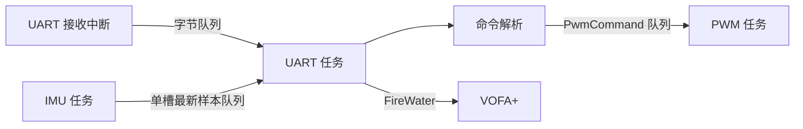

# FreeRTOS 进阶：模块阅读与验收

## 三个任务怎样配合

`Core/Src/freertos.c → AppTasks_Init` 先创建资源，再创建 PWM、UART、IMU 三个任务。

| 文件 / 函数 | 职责与参数 |
| --- | --- |
| app_tasks.c / AppTasks_Init(void) | 创建共享资源和三个任务，作为启动入口 |
| pwm_control.c / PwmControl_Init(void) | 创建长度 8 的命令队列 |
| pwm_control.c / PwmControl_Submit(command) | command 指向完整命令；复制入队，不等待；返回 pdPASS 或失败 |
| pwm_control.c / PwmControl_Task(argument) | 5 ms 更新 PWM；argument 当前不用 |
| imu_acquisition.c / ImuAcquisition_Init(void) | 创建长度 1 的最新样本队列 |
| imu_acquisition.c / ImuAcquisition_TakeLatest(message) | message 为输出结构体；无新样本立即返回失败 |
| imu_acquisition.c / ImuAcquisition_Task(argument) | 初始化 MPU6050，然后每 10 ms 读取六轴原始数据 |
| uart_service.c / UartService_Init(void) | 创建串口发送互斥锁和 128 字节接收队列 |
| uart_service.c / UartService_Task(argument) | 接收完整命令行，每约 20 ms 输出最新 IMU 样本 |
| uart_service.c / UartSend(huart, data, size, timeout) | huart 指定 UART；data 指向待发送字节；size 是字节数；timeout 是 HAL 发送超时 ms。先获取发送锁，返回 HAL 状态，仅供任务调用 |
| uart_service.c / HAL_UART_RxCpltCallback(huart) | 中断把已收字节入队，重新挂接下一字节，再按需要请求任务切换 |
| command_parser.c / CommandParser_Process(line) | line 是不含 CR/LF、以零结尾的完整命令；校验、投递并回复 |

## 关键参数

| 项目 | 当前值及意义 |
| --- | --- |
| PWM / IMU / UART 优先级 | 4 / 3 / 2，数值越高任务优先级越高 |
| PWM / UART / IMU 栈深度 | 256 / 384 / 512 words，STM32 上分别为 1024 / 1536 / 2048 字节 |
| PWM 更新 / IMU 读取 | 5 / 10 ms，使用 vTaskDelayUntil 固定时间基准 |
| UART 数值帧间隔 | 当前 20 ms，包含阻塞发送与调度影响；不是精确硬件定时输出 |
| B 命令 | B0..B1000，设置呼吸灯峰值，不是固定亮度 |
| T 命令 | T200..T10000，设置完整呼吸周期 ms |
| 默认峰值 / 呼吸周期 | 1000 / 2000 ms |
| IMU 地址 / 量程 | 7 位地址 0x68；±2 g / ±250 deg/s，数值帧仍输出原始 int16 |

## 要看懂的部分

- 命令队列复制结构体，解析函数的局部 command 结束后不会成为悬空指针。
- IMU 用长度 1 的覆盖队列，避免显示积压的旧样本；UART 消费速度不会直接拖慢采集任务。
- 14 字节 IMU 数据中 6..7 是温度，要跳过再拼接陀螺仪的 8..13；每轴高字节在前。
- 中断使用 FromISR API，解析、打印和互斥锁操作留给任务。发送锁防止 IMU 错误提示与数值帧交叉。
- 命令必须以 LF 或 CRLF 结束；超长行丢弃到换行，避免把截断命令当作合法命令。
- OK queued 表示队列接受命令，PWM 在下一次更新时应用。B0 的电平含义还要结合 LED 接线极性。
- `pdMS_TO_TICKS` 把 ms 换成调度器 tick；绝对延时避免累计执行时间，但精度仍受 tick、抢占和超时影响。

## 验收

1. 呼吸灯工作，FireWater 出现 8 通道：ax,ay,az,gx,gy,gz,sample_count,read_errors。
2. sample_count 持续增加，正常读取时 read_errors 不增加。
3. 发送带换行的 B100、T500，收到 OK queued，峰值/呼吸速度按命令变化。
4. 发送 B1200、T100，收到 ERR range；Keil 可观察 uart_rx_dropped，正常命令流应保持 0。

阅读顺序建议：app_tasks → command_parser → pwm_control → imu_acquisition → uart_service。
